# Balance by Gate of Steiner

**Team:** Lim Ze Heng, Tan Yi Ming, Chong Zhi Xuan, Matthew Thien Yung En  
**Problem Statement:** Stress & Workload Manager  
**Video Presentation:** https://www.youtube.com/watch?v=DV6PFbYdbk8 

**Presentation Slides:** https://docs.google.com/presentation/d/1_ctq2F96NrVD1dD9PSV1PLKwfyI83E4G-brSaejZjLE/edit?usp=sharing

## 1. Project Overview

### The Problem

University students often manage assignments, examinations, part-time shifts, family responsibilities, club activities, group work and personal rest within the same limited period. The core problem occurs when the time and energy required by these commitments exceed the student's actual capacity. Contributing causes include overlapping deadlines, incomplete task estimates, unclear flexibility, unprotected sleep or recovery limits, and shared commitments that cannot be changed without another person's agreement.

Students may recognise that they are overloaded but still cannot answer three practical questions: **What must remain protected? What can be adjusted? What consequences will each adjustment create?** Moving one task may protect tonight's sleep while increasing tomorrow's workload, creating deadline risk or affecting teammates. Students are the primary stakeholders; secondary stakeholders include teammates, family members, club members and university support services affected by or supporting the student's decisions.

Existing solutions address parts of this problem. Todoist supports task organisation, replanning and collaboration, while Finch supports self-care goals and gamified engagement. Balance explores how protected commitments, adjustment consequences, agreement requirements and recovery time can work together in one workload decision flow. A detailed comparison appears in Section 4.

### Our Solution

Balance is a stress and workload management application that helps university students create a realistic plan when every commitment cannot fit within their available time. It follows a **Detect → Decide → Recover → Reflect** process: the system identifies overload, protects non-negotiable commitments, and compares possible adjustments before the student confirms any change. Each option explains its effects on deadlines, future workload, rest and collaboration.

Once a confirmed plan creates genuine free time, Balance helps the student protect that time for optional recovery and later reflect on recurring workload patterns. The RPG layer makes the journey memorable while practical feature names remain visible and understandable.

### Feature Set

| Practical feature | RPG label | Purpose |
|---|---|---|
| Workload Overview | World Status | Shows available and planned time, five workload dimensions and an illustrative cumulative workload trend. |
| Optional Check-in | Status Appraisal | Records optional sleep and self-reported energy. Missing input remains **Unknown**. |
| Tasks and Protected Commitments | Quest Board and Sacred Contracts | Records duration, deadline, flexibility, protection status and whether a commitment is optional. |
| Overload Alert | Calamity Alert | Shows the difference between genuinely available time and planned task time. |
| Plan Comparison | War Council | Compares valid adjustments and explains deadline, future-load, rest and collaboration effects. |
| Recovery Nudge | Sanctuary | Offers optional recovery only after a confirmed plan creates genuine free time. |
| Weekly Reflection | Journey | Summarises private weekly patterns, protected time and conflicts handled early. |
| Sustainable Achievements | Journey Milestones | Recognises safe planning without leaderboards, streak penalties or rewards for overwork. |

## 2. Ideation & Process

### 2.1 Ideas We Considered

| Direction | Decision | Reason |
|---|---|---|
| Debt-based Workload Model + Load Balancer + Recovery Nudge | Chosen | Connects cumulative workload detection, a concrete planning decision and protected recovery time. |
| RPG framing | Refined and retained | Makes the experience memorable while keeping practical labels visible and avoiding a complex game economy. |
| Journey and Sustainable Achievements | Added | Responds to mentor feedback on retention by rewarding safe planning and private reflection without streak pressure. |
| Negotiation AI | Refined | Changed from generated external messages into user-confirmed plan comparison and a **Needs Agreement** state. |
| Energy Currency | Dropped | Too difficult to explain credibly in a 3–5 minute demo and shifted attention toward a game economy. |
| Peer Comparison | Dropped | Added privacy and multi-user complexity; comparison could also increase anxiety. |

### 2.2 Ideation Boards

#### Early Problem and Solution Exploration

These three original handwritten pages record early problem framing, proposed solutions and unresolved questions in Chinese. The English summaries below describe the legible content rather than provide a word-for-word transcription. They document design exploration, not user interview findings or validated outcomes.

##### Early draft A — Practical constraints and continued use

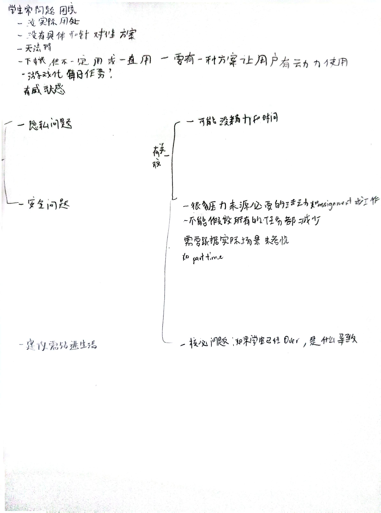

The notes consider why students may not continue using an app and explore gamification, daily tasks and a sense of achievement. They also raise privacy and security concerns. A key observation is that stress can arise from necessary commitments, including assignments and part-time work: the system cannot assume every task can be reduced.

**Connection to the current design:** Protected commitments and consequence-aware trade-offs address the concern that necessary responsibilities cannot simply disappear. Journey Milestones retain the achievement idea while avoiding compulsory daily tasks and streak penalties.

##### Early draft B — Proposed responses to student needs

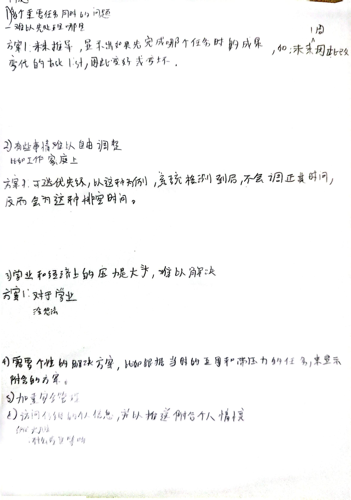

The notes explore showing the effects of completing tasks, protecting work and family time, providing personalised suggestions based on available time and stressful tasks, and strengthening security. They acknowledge academic and financial pressures that may be difficult for the app to resolve.

**Connection to the current design:** Fixed and protected commitments, capacity checks and plan comparison make these proposals more specific. The current scope focuses on workload decisions and does not claim to resolve financial or academic pressures themselves.

##### Early draft C — Scheduling rules and unresolved questions

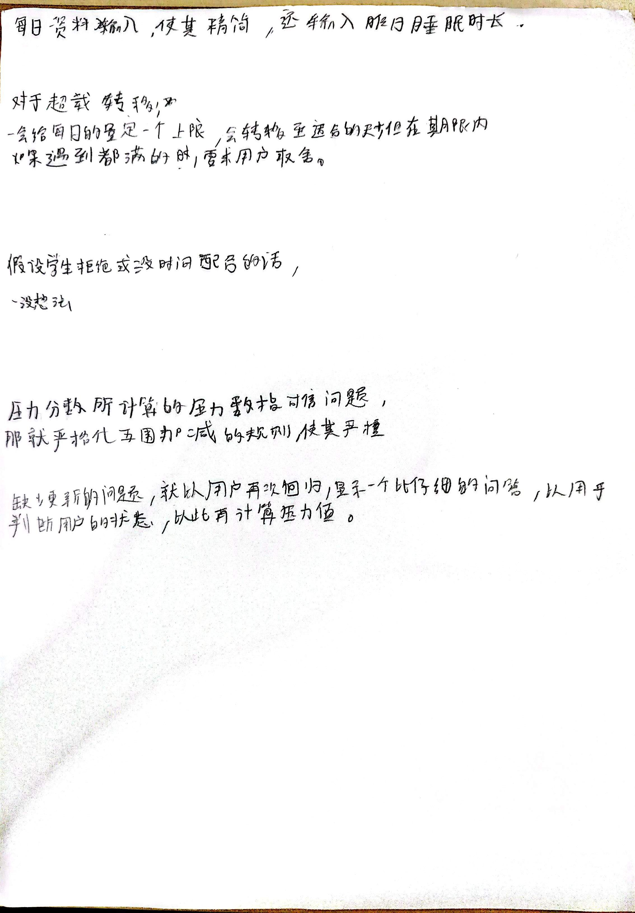

The notes propose keeping daily input short, including the previous night's sleep duration, setting a daily task limit and moving work to a suitable day within its deadline. They recognise cases requiring user input and question what happens if a student rejects a suggested schedule change.

**Connection to the current design:** Changes require confirmation; rejection preserves the current plan; missing information remains **Unknown** or **Needs Review**; and pending agreement does not count as freed time. The prototype does not claim a clinically valid stress score.

#### Design Evolution 

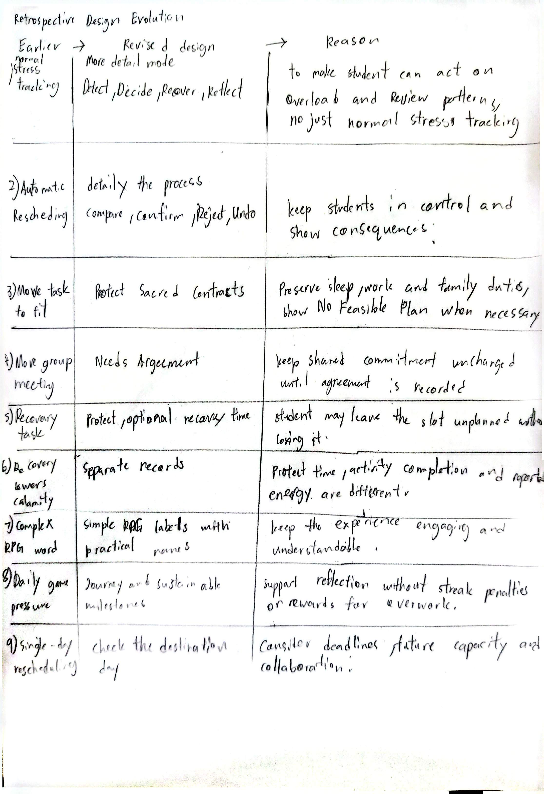

#### Mindmap

##### Draft version

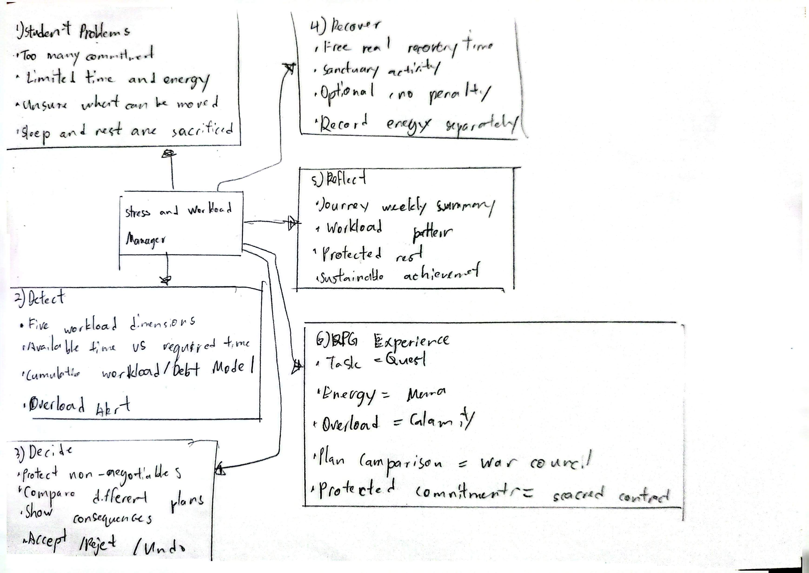

##### Final version

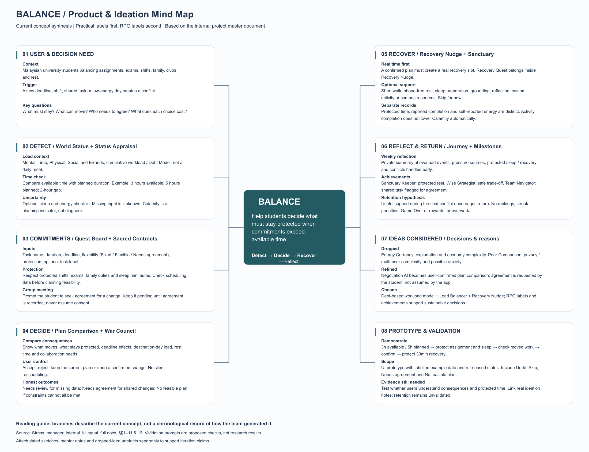

The final mind map connects student workload conflicts to the **Detect → Decide → Recover → Reflect** journey. It links capacity awareness to protected commitments and consequence-aware plan comparison, then connects genuine free time to optional recovery and private reflection. Practical feature names accompany RPG labels to explain their purpose.

#### Problem Tree

##### Draft version

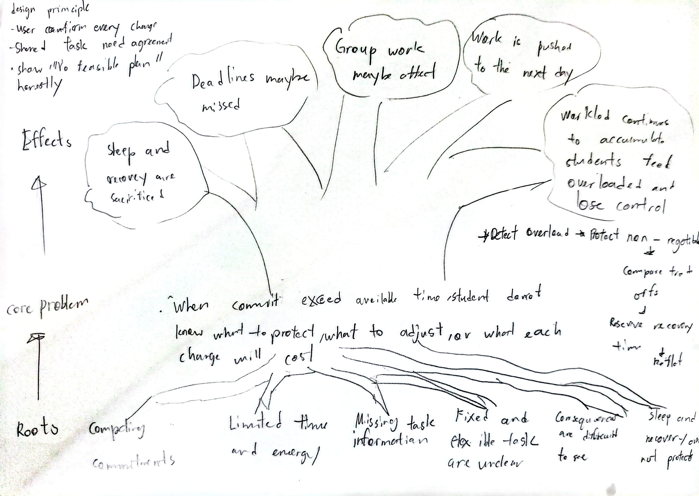

##### Final version

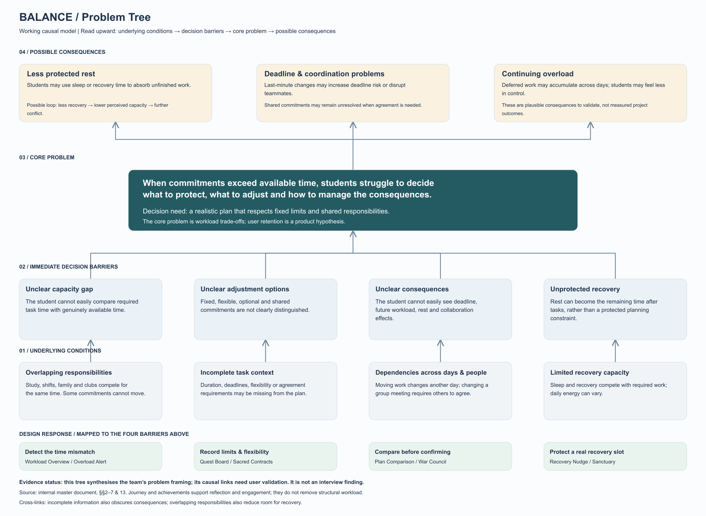

The problem tree links overlapping responsibilities, incomplete task information and dependencies across days and people to four decision barriers: an unclear capacity gap, uncertain adjustment options, hidden consequences and unprotected recovery time. These barriers informed the Workload Overview, Quest Board and Sacred Contracts, War Council, and Sanctuary. The causal links are working hypotheses to validate, rather than confirmed interview findings.

### 2.3 Mentor Consultation

| Date | Mentor |Mentor feedback | What changed |
|---|---|---|---|
| 6 Sep 2026 | Lim Zi Yang | Develop a distinctive response beyond reproducing the problem statement. Consider multi-device use, privacy and security, and avoid relying on AI for the team's original brainstorming. | Added protected commitments and consequence-aware trade-offs; removed peer comparison; made self-reporting optional; limited the prototype to rule-based example data and avoided medical claims. |
| 8 Sep 2026 | Lim Zi Yang | Define a specific use case, examine existing stress and workload apps, and decide how physical or mental wellbeing and gamification support that use case. | Defined the 3-hours-available versus 5-hours-planned scenario. Recovery now appears only after real capacity is freed, while RPG labels support the planning flow. |
| 11 Sep 2026 | Lim Zi Yang | Reconsider how group meetings are changed. Address retention, progress reflection, expanded Sanctuary support and game elements. | Added **Needs Agreement** for shared commitments; Journey as a private weekly reflection; sustainable planning achievements; and broader optional Sanctuary activities. |

## 3. Design & Prototype

**UI Prototype:** https://www.figma.com/design/oLcPugPWy5bqWTTPPxmYtm/Balance-%E2%80%94-RPG-Workload-Manager?node-id=0-1

The current Figma prototype presents eight ordered mobile UI screens illustrating a university student with three hours available tonight and five hours of planned tasks. The experience follows the **Detect → Decide → Recover → Reflect** journey.

### Key Screen Flow

| Step | Practical feature / RPG label | Intended interaction |
|---|---|---|
| 1 | Optional Check-in / Status Appraisal | The student may record current energy and rest information. These optional readings inform the status view but do not automatically change the schedule. |
| 2 | Workload Overview / World Status | The interface compares 3 available hours with 5 planned hours, states the 2-hour capacity gap, and displays Mental, Time, Physical, Social and Errands separately. |
| 3 | Commitment Map / Quest Board | Protected sleep and family commitments are separated from fixed and flexible tasks. |
| 4 | Plan Comparison / War Council | The student compares proposed adjustments and their consequences before confirming a plan. |
| 5 | Confirmed Plan / Plan Updated | The interface shows what moved, what stayed protected and the time opened. Undo remains available. |
| 6 | Recovery Nudge / Sanctuary | The corrected scenario leaves 30 minutes after moving 150 minutes of tasks. The student can reserve this time or leave it unplanned. |
| 7 | Weekly Summary / Journey | A private weekly view presents workload patterns, protected recovery time and sleep protection. |
| 8 | Planning Achievements / Journey Milestones | Milestones recognise sustainable planning without streak penalties or peer rankings. |

### Core Interaction Principles

- **User control:** No task or commitment moves without confirmation.
- **Protected constraints:** Sleep, family responsibilities and other non-negotiable commitments cannot be sacrificed simply to make the schedule appear feasible.
- **Visible consequences:** Every proposed adjustment explains its cost before the student decides.
- **Optional recovery:** Sanctuary protects genuine free time without turning recovery into another compulsory task.
- **Clear terminology:** Practical feature names appear together with their RPG equivalents.
- **Honest feedback:** Calculations, self-reports and example data are distinguished. The product makes no medical, diagnostic or therapeutic claims.

### Selected UI Reference Screens

#### 1. Optional Check-in / Status Appraisal

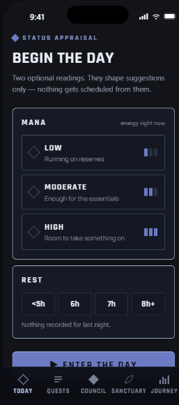

#### 2. Workload Overview / World Status

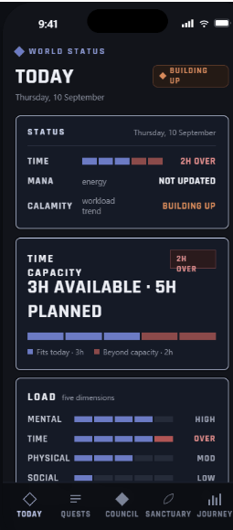

#### 3. Commitment Map / Quest Board

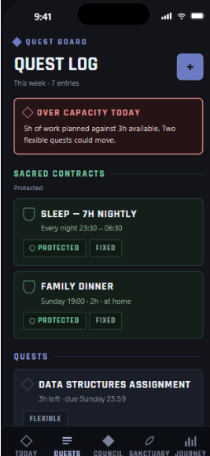

#### 4. Plan Comparison / War Council

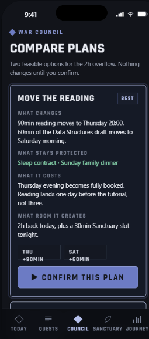

#### 5. Confirmed Plan / Plan Updated

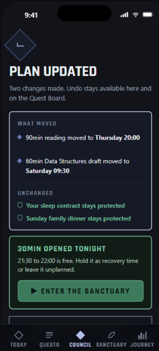

#### 6. Recovery Nudge / Sanctuary

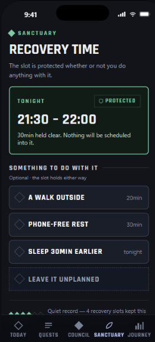

#### 7. Weekly Reflection / Journey

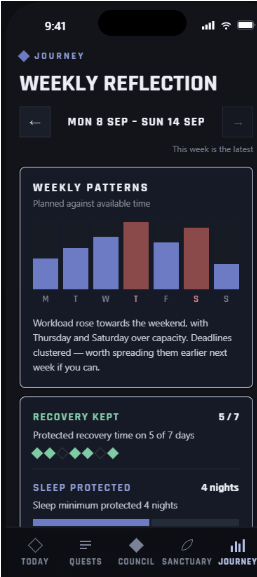

#### 8. Sustainable Achievements / Journey Milestones

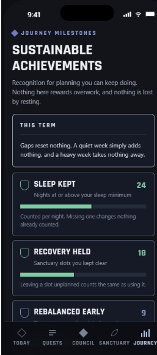

## 4. What Makes It Different

| Distinctive mechanism | Why it matters |
|---|---|
| Non-negotiable Commitments | Students protect a shift, exam, family duty, shared task or sleep minimum. The plan cannot sacrifice these simply to appear successful. |
| Consequence-aware Trade-offs | Balance previews what changes, what remains protected, destination-day capacity, deadline effects, rest effects and agreement needs before confirmation. |
| Recovery Follows Real Capacity | Recovery appears only after a confirmed change creates time. Protected time, reported completion and self-reported energy remain separate. |
| Honest Uncertainty | Missing information becomes **Needs Review**; shared changes become **Needs Agreement**; impossible constraints return **No Feasible Plan**. |
| Light RPG Framing | Every RPG label is paired with a practical name. Milestones reward sustainable decisions without leaderboards, streak penalties or Game Over states. |

### Comparison with Existing Solutions
We reviewed official feature descriptions from Todoist and Finch to identify where Balance could add value.

| Existing solution | Documented capabilities| Balance’s proposed distinction |
|---|---|---|
| Todoist | Task priorities, schedule replanning, shared projects, task assignments and productivity tracking. | Balance proposes a guided comparison that checks protected commitments, destination-day capacity and agreement requirements before a schedule change is confirmed. |
| Finch | Self-care goals, daily Quests, Streaks and weekly milestones for self-care areas. | Balance connects optional recovery to time actually released by a workload decision. A recovery slot may remain unplanned, and activity completion does not automatically imply improved energy. |

Sources: Todoist official features and Finch official features.
Our differentiation is the combined decision flow. For a student with three available hours and five hours of work, Balance is designed to identify what must stay protected, explain which changes are possible, check their consequences, and reserve any remaining time for optional recovery. A shared commitment awaiting agreement does not count as freed time.

RPG labels and achievements support this flow; they are not claimed as independently original features. Balance’s proposed milestones focus on sustainable planning, such as protecting sleep and addressing conflicts early.
This comparison reflects the official pages reviewed, rather than exhaustive product testing. It does not establish that competitors cannot support similar workflows. Balance currently demonstrates the proposed approach through static prototype screens; its decision rules and user benefits still require implementation and validation.

 
## 5. Technical Architecture & Feasibility

### Tech Stack

| Layer | Planned choice | Reason and constraint |
|---|---|---|
| Prototype | Figma static screen flow | Eight ordered reference screens illustrate intended states. |
| Product frontend | React, TypeScript and Tailwind CSS | Supports a responsive mobile-first web interface with one codebase. |
| Decision engine | Client-side rule-based checks | Checks duration, deadlines, destination capacity, protected commitments and agreement status without machine learning. |
| MVP data | Seeded example data / in-memory browser state | Planned local demo state resets on refresh until persistence is implemented. |
| Stretch data and authentication | Supabase PostgreSQL and Supabase Auth | Adds per-user persistence after the interaction flow is stable. |
| Hosting | Vercel | Provides a straightforward deployment path for the React application. |

### Architecture Patterns

The planned product uses a modular monolith with layered responsibilities. MVVM separates views from presentation state; application use cases coordinate Detect, Decide, Recover and Reflect; the domain core contains workload, constraint, trade-off and recovery rules; and Repository interfaces isolate storage.

The architecture follows three SDA principles: **Separation of concerns**, **Dependency direction toward core policies**, and **Abstraction through application-owned ports**. Calendar, notification, campus-resource and cloud adapters remain optional until implemented and tested.

#### Confirmation and undo behaviour

The Confirm Plan use case revalidates durations, deadlines, destination-day capacity, protected commitments and agreement status. If required information is missing or a constraint fails, it returns **Needs Review**, **Needs Agreement** or **No Feasible Plan** without changing the schedule.

A valid confirmation stores the previous plan, applies the selected changes and updates the interface. Undo restores the previous task placements and recovery reservation together.

#### Workload model and data boundaries

The time-capacity gap is calculated as:

`max(0, planned task minutes − available minutes)`

Other workload dimensions use labelled self-reports; missing input remains **Unknown**. The prototype uses illustrative historical data. The accumulation and update rules for the Debt-based Workload Model still require definition and validation before a working cumulative score is claimed. Scheduling or completing a recovery activity does not automatically lower workload or demonstrate improved energy.

### System Architecture

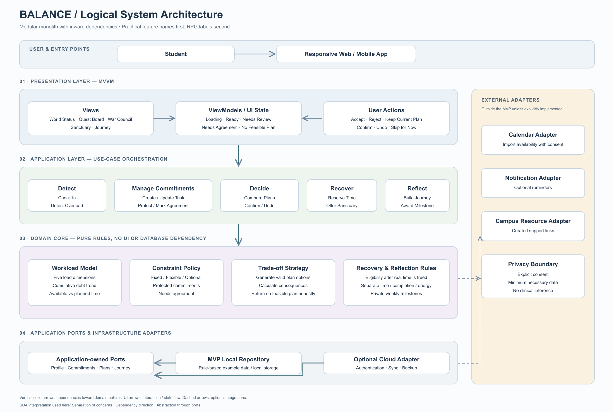

### Build Plan & Scope

| Phase | Deliverable | Scope |
|---|---|---|
| 1. Foundation | Responsive app shell, navigation, shared components and consistent practical/RPG terminology. | Committed |
| 2. Detect | Task entry, optional check-in, protected commitments, five load dimensions and the capacity-gap state. | Committed |
| 3. Decide | Rule-based plan options, consequence summaries, Needs Review, Needs Agreement, No Feasible Plan, Confirm and Undo. | Committed |
| 4. Recover | Reserve genuine free time and provide optional Sanctuary activities with Skip for Now. | Committed |
| 5. Reflect | Journey weekly summary and non-repeatable sustainable planning milestones. | Committed |
| 6. Validate and polish | Test the 3-hour versus 5-hour scenario for comprehension, navigation and consistency. | Committed |
| 7. Persistence | Supabase authentication and per-user storage after the complete local flow works reliably. | Stretch |

### Out of Scope for This Build

Machine learning, burnout diagnosis or prediction, therapy claims, automatic messages to lecturers or teammates, live calendar integration, push notifications, social comparison, multiplayer systems, combat mechanics and an equipment economy are outside this build.

## References

- Todoist. *Features*. https://www.todoist.com/features  
- Finch. *Finch Features*. https://help.finchcare.com/hc/en-us/categories/37934152903309-Finch-Features
